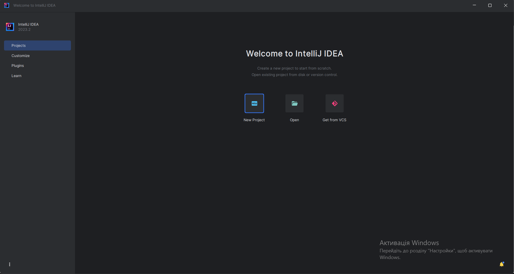
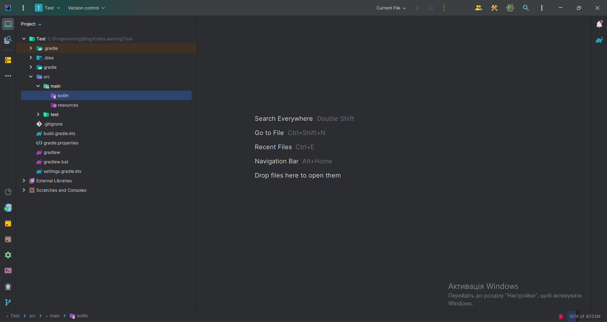
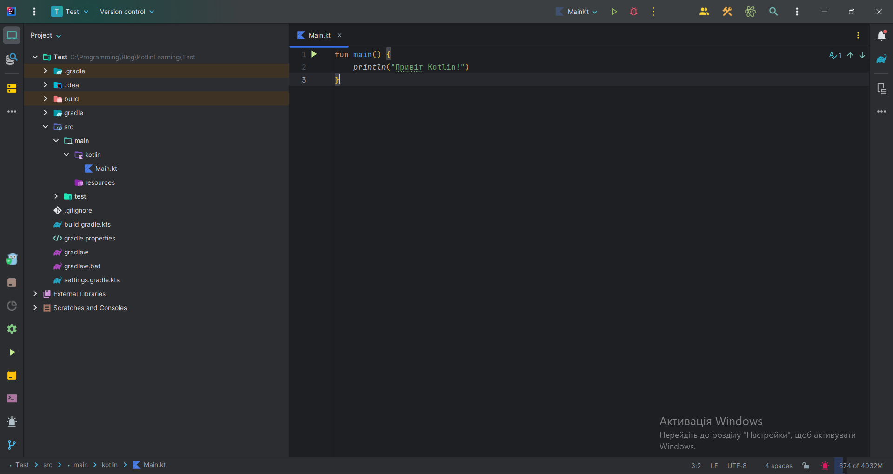
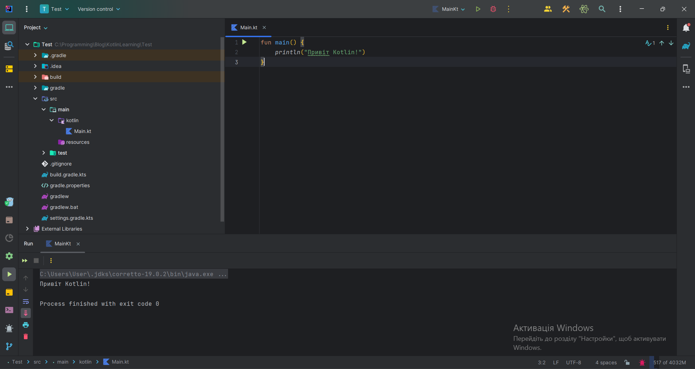

# Середовище розробки
Середовище розробки - це програма, яка дозволяє зручно писати код та компілювати його. Інакше кажучи, без цього нікуди. Для програміста, середовище розробки - це те саме, що бензин для машини.

## Основне середовище розробки
Першим кроком у вашому шляху розробки на Kotlin буде вибір зручної середи розробки. Однією з найкращих і популярних середовищ для роботи з Kotlin є Intellij IDEA. Ця інструкція допоможе вам ознайомитися з основами створення вашого першого проєкту в Intellij IDEA.

## Встановлення Intellij IDEA
Intellij IDEA має дві версії: **Community Edition** (безкоштовна) і **Ultimate Edition** (платна). Для новачків, різниця між ними не така велика, тому можна спокійно користуватися Community Edition.

:::tip Корисна порада
Студенти можуть отримати безкоштовну ліцензію на Ultimate Edition, заповнивши [цю форму](https://www.jetbrains.com/shop/eform/students).
:::

Ви можете завантажити Intellij IDEA з [офіційного веб-сайту](https://www.jetbrains.com/ru-ru/idea/download/#section=linux) або використовувати спеціальний інсталятор - [JetBrains Toolbox](https://www.jetbrains.com/ru-ru/toolbox-app/). Після завантаження, встановіть і налаштуйте Intellij IDEA, вибираючи потрібні опції, такі як тема тощо.

## Створення першого проєкту
Тепер, коли ми маємо встановлену Intellij IDEA, давайте створимо наш перший Kotlin проєкт.

1. Відкрийте Intellij IDEA та оберіть опцію "New Project" при запуску.



2. Дайте назву своєму проєкту. Важливо використовувати латинські символи для назви проєкту.

3. Виберіть мову програмування Kotlin та систему збирання, яку пропонує Intellij IDEA (наразі не потрібно глибоко розбиратися в цьому).

4. Натисніть "Create" для створення проєкту.


5. У вікні проєкту ви побачите стандартну структуру проєкту.



## Перша програма

Усі ваші файли Kotlin-коду повинні розміщуватися в теку "src/main/kotlin". Для початку можна створити файл "Main.kt", де ви зможете розпочати програмування.

Для створення нового файлу, правою кнопкою миші клікніть на теку "kotlin" -> "New" -> "Kotlin File", і назвіть його "Main".

Тепер у вас є підготовлене середовище для розробки на Kotlin з використанням Intellij IDEA. Готові до написання вашого першого Kotlin коду!

```kotlin
fun main() {
    println("Привіт Kotlin!")
}
```



Якщо ми нажмемо на зелений трикутничок який є на 1 лінії коду, то наша програма виведе на екран текст "Привіт Kotlin!".


В наступному уроці ми більш детальніше розберемо цю програму.