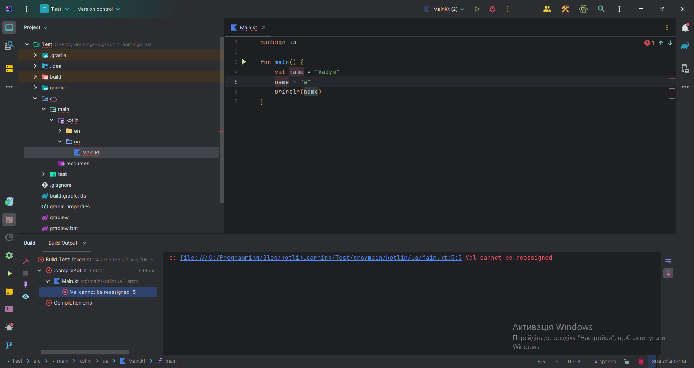

# Змінні та типи даних

Ласкаво просимо до основ мови програмування Kotlin!

## Змінні: Основи
**Змінна** - це символ або набір символів, які представляють собою певну величину або значення. Змінні використовуються для зберігання результатів обчислень та даних, які можуть змінюватися в процесі виконання програми. Наприклад ми зробили якесь обчислення щоб його зберегти потрібно записати значення в змінну, а згодом ви можете використати її в програмі.

## Змінні в Kotlin
В Kotlin, для створення змінної використовується ключове слово `var`. Ось загальний синтаксис для створення змінної:

```kotlin
var [назва_змінної]: [Тип_даних] = [значення_змінної]
```

:::tip Корисно знати
Не обов'язково потрібно вказувати тип даних для змінної, тому що компілятор сам його визначає.
:::

Вимоги до правильної назви змінної:
* Змінна має обов'язково починатися з маленької літери або символу підкреслення.
```kotlin
var myCarName: String = "Mercedes" // Правильно
var _myCarName: String = "Toyota" // Правильно

var MyCarName: String = "Tesla" // Впринципі наша програма буде працювати, але дуже не рекомендується називати змінну з великої літери
var 1myCarName: String = "BMW" // Неправильно, код не буде компілюватися, і наша програма не зможе працювати
var $myCarName: String = "Audi" // Неправильно, аналогічно до минулого запису, тому що будь-який спецільний символ крім символа "_" не може бути на початку змінної
```
* В середині або в кінці змінної може бути літера будь яка, цифра та символ підкреслення
```kotlin
var cat: String = "Tom" // Правильно
var cat8 = "King" // Правильно

var c_at = "Garry" // Правильно, але не варто так робити, це не відповідає стилю написання коду на Kotlin
```
* Якщо у змінній кілька слів, всі слова після першого починаються з великої (наприклад: `kotlinCourse`. Цей вид запису називають *lower camel case*)
```kotlin
var thisIsLowerCamelCase = "lowerCameCase" // Правильне найменування змінних в яких декілька слів

var this_is_snake_case = "snake_case" // Неправильне найменування змінної, воно буде працювати але так робити не варто
var this-is-kebab-case = "kebab-case" // Неправильне найменування змінної, це не буде працювати, буде помилка на стадії компліляції програми
```

Після того як ви створили змінну за допомогою ключового слова var, ви можете змінити її значення згодом
```kotlin
[назва_змінної] = [значення_змінної]
```
Наприклад:
```kotlin
var name: String = "Vadym" 
println(name) // На екран виведеться "Vadym"
name = "Ronny"
println(name) // На екран виведеться "Ronny"
```

## Не змінюванні змінні в Kotlin
Можливо це звучить дуже дивно але в котліні є змінні які в подальшому не можна буде змінити і це логічно тому що не завжди є така потреба і це дуже зручно.

Наприклад, якщо вам потрібно одноразово зробити якесь обчислення та переконатися, що ви ніде його випадково не зміните (щоб не викликати помилки у роботі вашої програми).
Запис нічим не відрізняється від змінюваної змінної, за винятком того, що для не змінюваної змінної ми використовуємо ключове слово `val` (з англійської value - значення).

```kotlin
val [назва]: [Тип] = [значення]
```

Приклад:
```kotlin
val myName: String = "Vadym"
val mySecondName = "Mykola" // Як вже було написано вище не обов'язково вказувати тип даних для змінної
```

Якщо виникло питання: а що буде якщо спробувати змінити не змінювану змінну? Думаю це потрібно побачити



## Типи даних
Раніше в уроці ми писали змінну і явно вказували тип даних, що ж давайте розберемо детальніше які бувають типи даних. Ці типи даних є фундаментом любої програми на Kotlin:
- **Byte** — ціле число, що є обмеженим від  `-128` до `127` (число обмежене 8-а бітами), на даний момент цей тип даних використовується дуже рідко тому що оперативна пам'ять є величезною і програмістам не варто рахувати кожен байтик.
```kotlin
val testByte: Byte = 125
```
- **Short** — ціле число, що є обмеженим від  `-32678` до `32677` (число обмежене 16-а бітами).
```kotlin
val testShort: Short = 6969 // аналогічно з byte рідко використовується
```
- **Int** — ціле число, що є обмеженим від  `-2147483647` до `2147483647` (число обмежене 32-а бітами).
```kotlin
val testInt: Int = 1215121
```
- **Long** — це той же Int, але відрізняється більшою розмірністю у два рази (до `9,223,372,036,854,775,807`).
```kotlin
val testLong: Long = 111_222_327_393_389 // символ підкреслення для зручності просто, без нього буде такий самий результат
```
- **Float** — число з число з плаваючою точкою (або, якщо простіше,  число з комою), що моє таке ж, як й *Int*, обмеження в вигляді 32-бітної розмірності (тобто числа до `340,282,346,638,528,860,000,000,000,000,000,000,000.000000`).
```kotlin
val testFloat: Float = 123.3f // В кінці нам варто додати літеру "f"
```
- **Double** — це той же Float, але знову ж, більшої розмірності (десь $1.7 \cdot 10^{308}$).
```kotlin
val testDouble: Double = 1233242.3213
```
- **Char** — звичайний тип, що описує будь-який символ.
```kotlin
val testChar: Char = 'A'
```
- **String** (рядок, текст) — простий текст. Складається з множини Char'ів (символів). Не має обмежень, якщо не враховувати 
RAM.
```kotlin
val testString: String = "some string"
```
- **Boolean** — логічний тип даних (має тільки два можливих значення: `true` або `false`)
```kotlin
val testBooleanTrue: Boolean = true
val testBooleanFalse = false // Тут ми могли вказати тип даних але вирішив нагадати що це робити не обов'язково
```

:::tip Корисно знати
Ми розібрали лише базові типи даних в котлін в майбутньому я навчу вас як створювати свій тип даних, але це буде трішечки пізніше
:::


## Додаткова інформація про побудову програми
В минулому уроці я обіцяв що ми розберемо як працює ось така програма:
```kotlin
fun main() {
    println("Привіт Kotlin!")
}
```
Ця коротка програма виводить фразу "Hello Kotlin!" на екрані. Давайте розберемося, як вона працює крок за кроком:

1. `fun main() {` - Кожна Kotlin програма починається з функції `main()`. Ця функція є вхідною точкою для виконання програми. Всі інші інструкції виконуються всередині цієї функції. Без цієї функції запуск програми неможливий, це таке саме як коли ти заводиш машину, якщо машина не заведена вона не поїде
2. `println("Hello Kotlin!")` - Ця інструкція використовує функцію `println()`, щоб вивести текст на консолі. У цьому випадку ми виводимо рядок "Hello Kotlin!".
3. `}` - Закриваємо функцію `main()` фігурною дужкою. Всі інструкції, які виконуються всередині функції `main()`, повинні бути відмічені фігурними дужками.

В подальшому ми розберемо детальніше що таке функції в Kotlin, і для вас все це буде ще більш зрозуміліше.