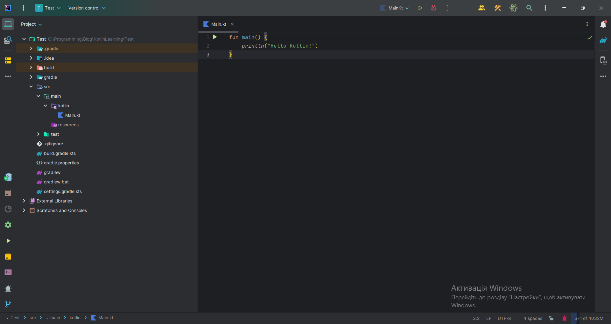

# Development Environment
A development environment is a program that allows you to conveniently write and compile code. In other words, it's essential for programming, much like gasoline is for a car.

## Primary Development Environment
The first step in your journey to Kotlin development is choosing a convenient development environment. One of the best and most popular environments for working with Kotlin is Intellij IDEA. This guide will help you get started with creating your first project in Intellij IDEA.

## Installing Intellij IDEA
Intellij IDEA comes in two versions: **Community Edition** (free) and **Ultimate Edition** (paid). For beginners, the difference between them isn't significant, so you can comfortably use the Community Edition.

:::tip Handy Tip
Students can obtain a free license for the Ultimate Edition by filling out [this form](https://www.jetbrains.com/shop/eform/students).
:::

You can download Intellij IDEA from the [official website](https://www.jetbrains.com/idea/download/#section=linux) or use a special installer called [JetBrains Toolbox](https://www.jetbrains.com/toolbox-app/). After downloading, install and configure Intellij IDEA, selecting the desired options such as themes, and so on.

## Creating Your First Project
Now that we have Intellij IDEA installed, let's create our first Kotlin project.

1. Open Intellij IDEA and select the "New Project" option at startup.


2. Give your project a name. It's essential to use Latin characters for the project name.

3. Choose the Kotlin programming language and the build system offered by Intellij IDEA (you don't need to dive deep into this for now).

4. Click "Create" to create the project.


5. In the project window, you will see the standard project structure.


## Your First Program

All your Kotlin code files should be placed in the "src/main/kotlin" directory. To start, you can create a file named "Main.kt," where you can begin programming.

To create a new file, right-click on the "kotlin" folder -> "New" -> "Kotlin File," and name it "Main."

Now you have a prepared development environment for Kotlin development using Intellij IDEA. You're ready to write your first Kotlin code!

```kotlin
fun main() {
    println("Hello Kotlin!")
}
```



If we click on the green triangle on line 1 of the code, our program will display the text "Hello Kotlin!" on the screen.


In the next lesson, we will delve more into this program.