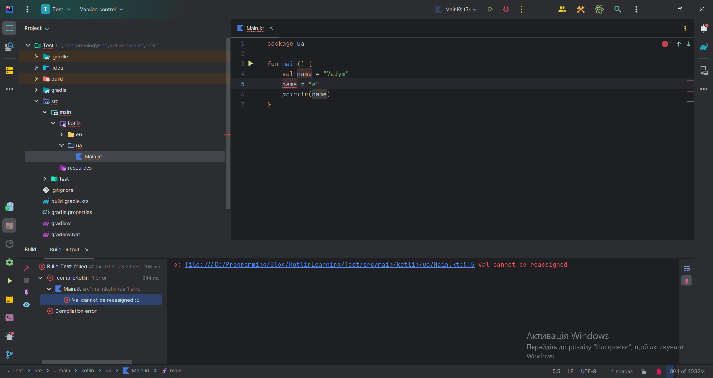

# Variables and Data Types

Welcome to the fundamentals of the Kotlin programming language!

## Variables: Basics
A **variable** is a symbol or a set of symbols that represent a particular value. Variables are used to store the results of computations and data that can change during program execution. For example, when you perform some calculations, you need to store the value in a variable, and later you can use it in your program.

## Variables in Kotlin
In Kotlin, to create a variable, you use the keyword `var`. Here is the general syntax for creating a variable:

```kotlin
var [variable_name]: [Data_Type] = [variable_value]
```

:::tip Good to know
It is not necessary to specify the data type for the variable, because the compiler itself determines it.
:::

Requirements for a correct variable name:
* The variable must start with a lowercase letter or an underscore character.
```kotlin
var myCarName: String = "Mercedes" // Correct
var _myCarName: String = "Toyota" // Correct

var MyCarName: String = "Tesla" // In principle, our program will work, but it is strongly not recommended to name the variable with an uppercase letter
var 1myCarName: String = "BMW" // Incorrect, the code will not compile and our program will not be able to run
var $myCarName: String = "Audi" // Incorrect, similar to the previous entry, because any special character other than the "_" character cannot be at the beginning of a variable
```
* Any letter, number and underscore can be in the middle or at the end of the variable
```kotlin
var cat: String = "Tom" // Correct
var cat8 = "King" // Correct

var c_at = "Garry" // That's right, but you shouldn't do that, it's not in line with Kotlin code writing style
```
* If the variable contains several words, all words after the first one are capitalized (for example: `kotlinCourse`. This type of entry is called *lower camel case*)
```kotlin
var thisIsLowerCamelCase = "lowerCameCase" // Correct naming of variables that contain several words

var this_is_snake_case = "snake_case" // Incorrect variable name, it will work, but it should not be done that way
var this-is-kebab-case = "kebab-case" // Incorrect variable name, it will not work, there will be an error at the program compilation stage
```

After you create a variable using the var keyword, you can change its value later
```kotlin
[variable_name] = [variable_value]
```
For example:
```kotlin
var name: String = "Vadym" 
println(name) // "Vadym" will be displayed on the screen
name = "Ronny"
println(name) // "Ronny" will be displayed on the screen
```

## Immutable variables in Kotlin
Maybe it sounds very strange, but in Kotlin there are variables that cannot be changed in the future, and this is logical because there is not always such a need and it is very convenient.

For example, if you need to do some calculation once and make sure you don't accidentally change it anywhere (so as not to cause an error in your program).
The record is no different from a mutable variable, except that for an immutable variable we use the keyword `val` (from the English value - value).

```kotlin
var [variable_name]: [Data_Type] = [variable_value]
```

Example:
```kotlin
val myName: String = "Vadym"
val mySecondName = "Mykola" //As it was already written above, it is not necessary to specify the data type for the variable
```

If the question arose: what will happen if you try to change an immutable variable? I think it should be seen



## Data types
Earlier in the lesson, we wrote a variable and clearly indicated the data type, so let's take a closer look at what data types are. These data types are the foundation of any Kotlin application:
- **Byte** is an integer limited from `-128` to `127` (the number is limited to 8 bits), at the moment this data type is used very rarely because RAM is huge and programmers don't count every byte.
```kotlin
val testByte: Byte = 125
```
- **Short** is an integer limited from `-32678` to `32677` (the number is limited to 16 bits).
```kotlin
val testShort: Short = 6969 // similar to byte is rarely used
```
- **Int** is an integer limited from `-2147483647` to `2147483647` (number limited to 32 bits).
```kotlin
val testInt: Int = 1215121
```
- **Long** is the same as Int, but has twice the dimension (up to `9,223,372,036,854,775,807`).
```kotlin
val testLong: Long = 111_222_327_393_389 // the underscore is simple for convenience, without it the result will be the same
```
- **Float** is a floating-point number (or, if simpler, a comma number), which mine is the same as *Int*, a 32-bit dimensionality restriction (ie numbers up to `340,282,346,638,528,860,000,000,000,000,000,000,000.000000`) .
```kotlin
val testFloat: Float = 123.3f // At the end we should add the letter "f"
```
- **Double** is the same Float, but again, with a larger dimension (somewhere $1.7 \cdot 10^{308}$).
```kotlin
val testDouble: Double = 1233242.3213
```
- **Char** is a regular type that describes any character.
```kotlin
val testChar: Char = 'A'
```
- **String** (string, text) — plain text. It consists of a set of Chars (characters). There is no limit unless you consider
RAM.
```kotlin
val testString: String = "some string"
```
- **Boolean** — logical data type (has only two possible values: `true` or `false`)
```kotlin
val testBooleanTrue: Boolean = true
val testBooleanFalse = false // Here we could specify the data type, but I decided to remind you that it is not necessary
```

:::tip Good to know
We have covered only the basic data types in Kotlin, in the future I will teach you how to create your own data type, but that will be a little later
:::


## Additional information about building the program
In the last lesson, I promised that we would analyze how such a program works:
```kotlin
fun main() {
    println("Hello Kotlin!")
}
```
This short program outputs the phrase "Hello Kotlin!" on the screen. Let's understand how it works step by step:

1. `fun main() {` - Every Kotlin program starts with the `main()` function. This function is the entry point to program execution. All other instructions are executed inside this function. Without this function, it is impossible to start the program, it is the same as when you start a car, if the car is not started, it will not start
2. `println("Hello Kotlin!")` - This instruction uses the `println()` function to output text to the console. In this case, we output the string "Hello Kotlin!".
3. `}` - Close the `main()` function with curly braces. All instructions that are executed inside the `main()` function must be marked with curly braces.

In the future, we will analyze in more detail what functions are in Kotlin, and it will all be even clearer for you.